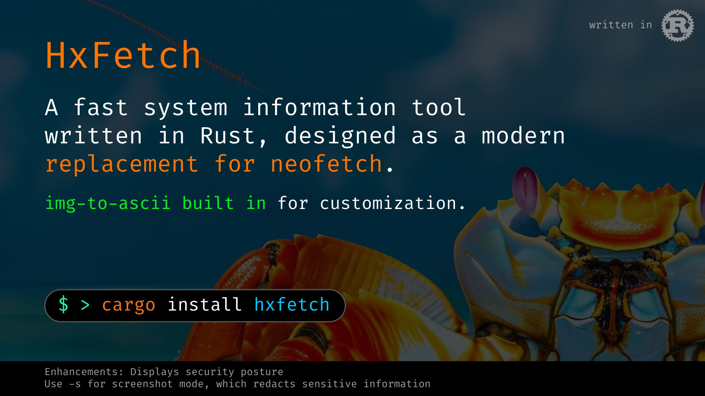

# HxFetch



A fast, modern system information tool written in Rust with comprehensive ASCII art support.

## Features

- **Fast system information collection** - Written in Rust for optimal performance
- **Rich ASCII art logos** - Support for 84+ distribution logos with custom ASCII maker
- **Flexible logo system** - TOML-based configuration for custom and user-generated logos
- **Configurable display** - Customize colors, layout, and information shown
- **Extensive OS support** - Built-in support for major Linux distributions, BSD, macOS, and more
- **ASCII art generator** - Built-in tool to convert images to colored ASCII art
- **Lightweight** - Minimal dependencies and fast execution

## Installation

```bash
git clone https://github.com/HxHippy/HxFetch.git
cd HxFetch
cargo build --release
sudo cp target/release/hxfetch /usr/local/bin/
```

## Usage

```bash
# Basic usage
rfetch

# Create custom ASCII logos from images
rfetch --ascii-maker

# Test with specific OS logo
OS="arch" rfetch
OS="ubuntu" rfetch
OS="kali" rfetch

# Configuration options
rfetch --generate-config
rfetch --no-config
rfetch --help
```

## ASCII Art System

rFetch includes a powerful ASCII art system with support for custom logos:

### Built-in ASCII Maker
```bash
rfetch --ascii-maker
```
Convert any image to colored ASCII art and automatically integrate it into rFetch. Supports:
- Automatic image resizing and optimization
- Color preservation with ANSI escape sequences
- Background removal for terminal theme compatibility
- Direct integration with logo configuration system

### Custom Logo Configuration
Logos are stored in `~/.config/rfetch/logos.toml`:
```toml
[logos.archlinux]
function_name = "arch_logo"
lines = ["ASCII art lines here..."]
colored = true
```

### Testing Different Logos
```bash
# Test any distribution logo
OS="distribution_name" rfetch

# Examples
OS="debian" rfetch
OS="fedora" rfetch
OS="gentoo" rfetch
```

## Configuration

Configuration files:
- Main config: `~/.config/rfetch/config.toml`
- Logo config: `~/.config/rfetch/logos.toml`

### Display Configuration Options
- `show_os`: Operating system information
- `show_kernel`: Kernel version
- `show_uptime`: System uptime
- `show_cpu`: CPU information
- `show_memory`: Memory usage
- `show_storage`: Storage usage
- `show_shell`: Current shell
- `show_desktop`: Desktop environment
- `show_terminal`: Terminal information
- `show_colors`: Color palette

### Color Customization
- `logo_color`: ASCII art logo color
- `accent_color`: Accent highlights
- `label_color`: Information labels
- `value_color`: Information values
- `separator_color`: Separators and borders

## Supported Distributions

rFetch includes ASCII logos for 80+ distributions including:

**Major Distributions:**
- Ubuntu, Debian, Arch Linux, Fedora, openSUSE
- CentOS, RHEL, Manjaro, Linux Mint, Elementary OS

**Security-Focused:**
- Kali Linux, Parrot OS, BlackBox, Pentoo, Tails
- Qubes OS, Whonix, Kodachi, Security Onion

**Specialized:**
- NixOS, Gentoo, Void Linux, Alpine Linux
- FreeBSD, OpenBSD, ReactOS, Raspberry Pi OS

**Desktop-Oriented:**
- Pop!_OS, Zorin OS, KDE Neon, EndeavourOS
- Garuda Linux, CachyOS, Nobara, Vanilla OS

*Full list available in the logo configuration system*

## Development

### Building
Requirements:
- Rust 1.70+
- Cargo

```bash
git clone https://github.com/HxHippy/HxFetch.git
cd HxFetch
cargo build --release
```

### Dependencies
- `sysinfo` - System information collection
- `clap` - Command line argument parsing
- `serde` - Configuration serialization
- `toml` - Configuration file format
- `rascii_art` - ASCII art generation
- `dirs` - User directory detection

### Contributing
1. Fork the repository
2. Create your feature branch
3. Add tests for new functionality
4. Ensure `cargo test` and `cargo clippy` pass
5. Submit a pull request

## Credits

- **ASCII Art Generation**: Powered by the [`rascii_art`](https://crates.io/crates/rascii_art) crate
- **RASCII Project**: Special thanks to [RASCII](https://github.com/orhnk/RASCII/) for ASCII art conversion techniques and inspiration
- **System Information**: Built on the [`sysinfo`](https://crates.io/crates/sysinfo) crate  
- **Inspiration**: Inspired by the original [neofetch](https://github.com/dylanaraps/neofetch) project by Dylan Araps
- **Logo Assets**: Distribution logos are property of their respective organizations

## License

MIT License - see [LICENSE](LICENSE) file for details